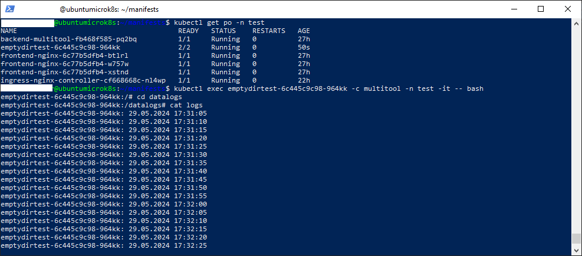
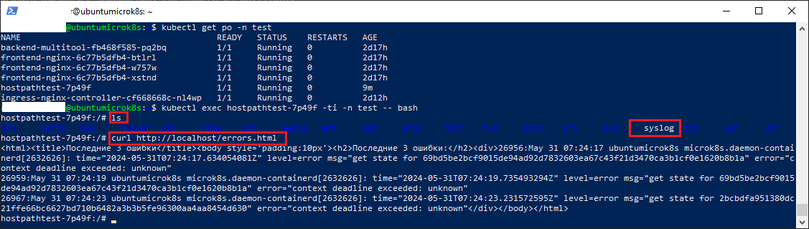

### Задание 1 

**Что нужно сделать**

Создать Deployment приложения, состоящего из двух контейнеров и обменивающихся данными.

1. Создать Deployment приложения, состоящего из контейнеров busybox и multitool.
2. Сделать так, чтобы busybox писал каждые пять секунд в некий файл в общей директории.
3. Обеспечить возможность чтения файла контейнером multitool.
4. Продемонстрировать, что multitool может читать файл, который периодоически обновляется.
5. Предоставить манифесты Deployment в решении, а также скриншоты или вывод команды из п. 4.

### Решение 1

1. Манифест Deplyment находится в [файле](manifests/emptydirvolume.yaml)
2. Разворачиваем манифест в простанстве *test* командой
    ``` kubectl apply -f emptydirvolume.yaml -n test```
3. Подключаемся к контейнеру multitool и стартуем оболочку *bash* командой: 
    ```kubectl exec emptydirtest-6c445c9c98-964kk -c multitool -n test -it -- bash ```
4. Проверяем содержимое файла *logs* командой: 
    ```cat /datalogs/logs```

Результат представляет собой:
  

------

### Задание 2

**Что нужно сделать**

Создать DaemonSet приложения, которое может прочитать логи ноды.

1. Создать DaemonSet приложения, состоящего из multitool.
2. Обеспечить возможность чтения файла `/var/log/syslog` кластера MicroK8S.
3. Продемонстрировать возможность чтения файла изнутри пода.
4. Предоставить манифесты Deployment, а также скриншоты или вывод команды из п. 2.

### Решение 2

1. Манифест DaemonSet находится в [файле](manifests/hostpathvolume.yaml)
2. Разворачиваем манифест в простанстве *test* командой
    ``` kubectl apply -f hostpathvolume.yaml -n test```
3. Подключаемся к контейнеру multitool и стартуем оболочку *bash* командой: 
    ```kubectl exec hostpathtest-7p49f -c multitool -n test -it -- bash ```
4. Так как *args* переопределяет стандартный entrypoint, то стартуем nginx и в бесконечном цикле раз в 5 минут считываем и записываем информацию об ошибках из файла syslog на страницу errors. Проверяем что nginx возвращает страницу errors.html с 3 последними ошибками из файла syslog ноды:
    ``` curl http://localhost/errors.html ```

Результат выполнения команд представлен на скриншоте. Основные команды выделены красным:
